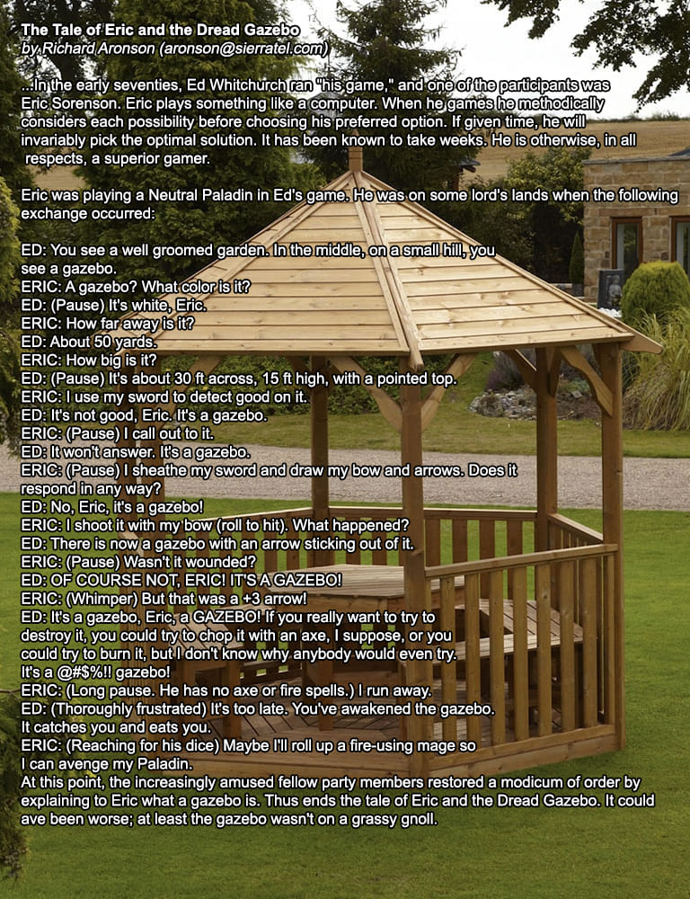

# DnD Crushing Bugs 

Solving bugs for the dungeons and dragons puzzle board. Two main issues were found:  
-More than one piece can be placed in an area at one given time.  
-When the background image changes, the puzzle pieces are not reset back to their original positions.  

The task is to solve these bugs and potentially find a solution to a third optional bug:  
-When the background image changes, the puzzle pieces do not change to reflect the new puzzle board.  

## Usage

TODO: Write usage instructions  

## Contributing  

Singer, Dan  
Westrop, Sophia  
ChatGPT  

## Credits

Singer, Dan- Author  
Westrop, Sophia- Study Buddy/Code Research Assistance  
ChatGPT- Code Checker and Helper   

Gazebo story credit: https://www.facebook.com/DnDDads/posts/did-you-ever-hear-the-tale-of-eric-and-the-dread-gazebo/886671365369918/  

## License  

MIT  

  